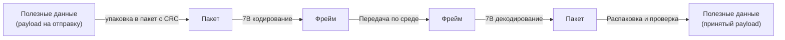

# ECB - Extended Centralized Bus

Общее описание протокола без привязки к реализациям.

Протокол типа `master-slaves`, для связи с простейшими устройствами.

Обнаруживает повреждение пакета с помощью CRC. Для запросов, требующих
ответа, протокол предусматривает timeout, повторную передачу и защиту от
повторного выполнения. Запросы без ответа передаются в режиме best effort и не
имеют гарантии доставки.

Может реализовываться в любой физической среде, для реализации необходимо определить способ передачи байта.

В качестве фрейминга пакетов(определение границ, начала и конца) используется способ с маркерным битом.
Т.к. реализация физического уровня - это поток байт(8-ми битных данных), то маркерным битом выступает 7-й(с 0),
старший бит данных.  
Это означает, что полезных бит в байте на шине только 7. Подробнее см. репозиторий [framer7b](https://github.com/jodzik/framer7b-c).

Все операции на шине инициирует мастер.  
Как правило, операция представляет собой пакет-запрос от мастера и пакет-ответ от слейва.  
Данные у слейвов представлены сигналами - массив байт. 

## Структура пакетов

Термины:
* **Фрейм(кадр)** - последовательность байт на шине, с байтом начала кадра и конца, данные кадра закодированы для передачи 7-ми битным кодированием, т.е. в них не встречается старший бит.
* **Пакет(Packet)** - бинарная структура байт, включающая полезные данные и служебные поля для адресации, управления, контроля целостности.

Полезные данные, принимают следующие трансформации, при передаче:  


### Общая структура пакета

При создании пакета, к полезным данным добавляется контрольная сумма CRC32, идентификаторы типа пакета, адрес устройства, идентификатор данных, номер транзакции.

Общая структура пакета:  
| Offset | Поле | Размер, байт | Описание |
|---:|---|---:|---|
| 0 | `pd` | 1 | Описатель пакета (Packet Descriptor) |
| 1 | `addr` | 1 | Адрес ведомого |
| 2 | `transaction_id` | 2 | Идентификатор транзакции, Little Endian |
| 4 | `data_id` | 1 | Идентификатор данных |
| 5 | `payload` | 0..4096 | Данные, зависящие от типа пакета |
| 5 + N | `checksum` | 4 | CRC32/ISO-HDLC, Little Endian |

Здесь `N` - размер `payload`.

**PD** - Packet Descriptor, от него зависит содержание и наличие поля `DATA`, состоит из нескольких битовых полей:  
| Offset | Поле | Размер, бит | Описание |
|---:|---|---:|---|
| 7 | `DIR` | 1 | направление пакета, 1 - запрос от мастера, 0 - ответ ведомого |
| 6 | `RESERVED` | 3 | Зарезервировано |
| 3 | `TYPE` | 4 | Тип операции |

Тип операции может быть:
* **WRITE** - `0b0000` операция записи данных, в запросе payload МОЖЕТ быть НЕ пустым, в ответе пустое, структура payload определяется приложением;
* **WRITE_NO_ANSW** - `0b0001` операция записи данных без подтверждения, в запросе поле данных МОЖЕТ быть НЕ пустым;
* **READ** - `0b0010` операция чтения данных, в запросе поле данных пустое, в ответе МОЖЕТ быть НЕ пустым, структура payload определяется приложением;
* **PUB_DATA** - `0b0011` операция публикации данных слейвом, без запроса от мастера, может применяться только в схеме 1-1, payload МОЖЕТ быть НЕ пустым, структура определяется приложением;
* **PROTO_ERR** - `0b1111` пакет с ошибкой протокола, возвращается ведомым устройством при ошибке уровня протокола, структура payload определяется протоколом.
* **APP_ERR** - `0b1110` пакет с ошибкой приложения, возвращается ведомым устройством при ошибке уровня приложения, структура payload определяется протоколом.

**DATA_ID** - 16-ти битный идентификатор данных - раздел информации у ведомого устройства, аналог регистров в ModBus.  
**DATA** - поле полезных данных.  
**CRC32** - контрольная сумма CRC32/ISO-HDLC.  

### CRC

Используется CRC-32/ISO-HDLC (CRC-32, IEEE 802.3):

| Параметр | Значение |
|---|---|
| Полином (normal) | `0x04C11DB7` |
| Полином (reflected) | `0xEDB88320` |
| Начальное значение | `0xFFFFFFFF` |
| RefIn / RefOut | true / true |
| XorOut | `0xFFFFFFFF` |
| Область расчёта | Все байты пакета, кроме самой CRC |

Контрольное значение алгоритма:

```text
CRC("123456789") = 0xCBF43926
```

Полученное 32-битное значение CRC записывается в пакет младшим байтом вперёд.
Пакет с неверной CRC молча отбрасывается. Поля такого пакета не считаются
достоверными и не могут использоваться для формирования ответа.

CRC предназначена для обнаружения случайного повреждения данных и не является
криптографической защитой.

### Идентификатор транзакции

`transaction_id` связывает запрос с подтверждением и ответ на него. Счётчик исходящих транзакций хранится на мастере.

Значение `0` зарезервировано для пакетов, не создающих транзакцию. В текущей
версии оно используется `WRITE_NO_ANSWER`.

Правила счётчика:

- первое выделяемое значение равно 1;
- при создании запроса используется текущее значение счётчика, после чего
  счётчик увеличивается;
- после значения 65535 следующим значением становится 1;
- одновременно peer может иметь не более одного активного исходящего запроса с
  подтверждением;
- новый `READ` или `WRITE` не отправляется до получения ответа или завершения
  текущей исходящей транзакции по timeout;
- наличие исходящей транзакции не мешает peer принимать запросы и отвечать на
  них.

Ответ должен содержать те же `transaction_id` и `data_id`, что и запрос. Ответ с
другим `transaction_id` или `data_id` не завершает активную транзакцию.

В запросах и ответах

### Структура payload пакета **PROTO_ERR**

| Offset | Поле | Размер, байт | Описание |
|---:|---|---:|---|
| 0 | `error_code` | 1 | Код ошибки |

`PROTO_ERR` отправляется только в ответ на пакет, который достоверно
распознан как запрос (`READ` или `WRITE`), но не может быть обработан из-за нарушения правил протокола.

Примеры таких ошибок:

- ненулевой `payload` в `READ`;
- нулевой `transaction_id` в `READ` или `WRITE`;
- новый запрос при наличии другого незавершённого входящего запроса;
- повторное использование того же `transaction_id` с другими полями запроса.

Правила ответа:

- `transaction_id` и `data_id` копируются из запроса;
- `payload` содержит ровно один байт `error_code`;
- ответ не отправляется при ошибке фреймирования, размера всего пакета или CRC;
- ответ не отправляется на `WRITE_NO_ANSWER` или пакет-ответ.

Коды ошибок протокола:

| Код | Имя | Описание |
|---:|---|---|
| `0x01` | `INVALID_PAYLOAD_SIZE` | Размер payload не соответствует типу запроса |
| `0x02` | `INVALID_TRANSACTION_ID` | Значение transaction_id недопустимо для типа запроса |
| `0x03` | `BUSY` | Предыдущий входящий запрос ещё не завершён |
| `0x04` | `TRANSACTION_CONFLICT` | Тот же transaction_id использован для отличающегося запроса |

### Структура payload пакета **APP_ERR**

`APP_ERR` отправляется, когда пакет соответствует правилам протокола,
но приложение не может выполнить запрос. Например, `data_id` отсутствует,
операция не поддерживается endpoint или значение `payload` недопустимо для
прикладного типа данных.

`transaction_id` и `data_id` копируются из запроса. Формат `payload`:

| Поле | Размер, байт | Описание |
|---|---:|---|
| `error_code` | 1 | Код ошибки приложения |
| `description` | 0..128 | Необязательная UTF-8 строка с завершающим `NULL` |

## Broadcast

Широковещательный адрес - 0xFF.  
Допустимые типы запросов для широковещательного адреса:
- `WRITE_NO_ANSW`.

## Повторная передача и дедупликация

Для `READ` и `WRITE` мастер хранит запрос до завершения транзакции. Если
ответ не получен за timeout, заданный для этого запроса, мастер может
повторить запрос.

Правила повторной передачи запроса:

- повтор имеет полностью идентичные `type`, `transaction_id`, `data_id` и
  `payload`;
- после исчерпания повторов транзакция завершается локальной ошибкой timeout;
- пока транзакция активна, другой запрос с подтверждением не отправляется.

Принимающая сторона(slave) хранит состояние последнего входящего запроса (все поля пакета кроме payload) и последний ответ(вместе с payload).  
И в случае приема повторного запроса(если предыдущий ответ не дошел до мастера и он повторил запрос с таким же `transaction_id`)
slave отправляет сохраненный ответ на этот запрос.

## Обработка ошибок потока

Следующие ошибки приводят к молчаливому отбрасыванию данных:

- неизвестный или некорректный управляющий байт фреймера;
- переполнение буфера фреймера;
- неканоническое BASE128-представление;
- декодированный пакет короче 8 байт;
- неверная CRC;

После восстанавливаемой ошибки обработка продолжается со следующего доступного
байта, чтобы корректный фрейм после повреждённого фрейма не был потерян.
Реализация может предоставлять счётчики диагностических ошибок, но ошибки линии
не должны сами по себе останавливать обработку следующих кадров.

## Представление данных

Каждый slave имеет собственный набор endpoint, доступных по `data_id`. Endpoint
определяет поддерживаемые операции и прикладной формат `payload`.

Правила представления:

- все многобайтовые числа кодируются в Little Endian;
- поля прикладных структур передаются последовательно, без автоматического
  выравнивания компилятора;
- все строки кодируются в UTF-8 и завершаются байтом `NULL` (`0x00`);
- завершающий `NULL` входит в размер строки и `payload`;
- пустая строка состоит из одного байта `0x00`;

Пример см. ниже  в **стандартные идентификаторы данных**.

## Стандартные идентификаторы данных

Если устройство, располагает этими данными, то по возможности нужно реализовывать обработчики для работы с этими данными.

Диапазон: [65280;65535]/[0xFF00;0xFFFF].

| Имя | `data_id` | Возможности | Тип данных | Описание |
|---:|---|---|---|---|
| `RESET` | `65280` | `WRITE`, `WRITE_NO_ANSWER` | `stuck_in_boot: bool` | Перезагрузка устройства, перезагружается записью, если записывается число больше нуля - перезагрузка с зависанием в загрузчике |
| `DEVICE_INFO` | `65281` | `READ` | `TLV: 1=>NAME(STRING) 2=>VERSION([u8;3]) 3=>SERIAL(STRING)` | Информация об устройстве |
| `PICK` | `65282` | `WRITE`, `WRITE_NO_ANSWER` | Проверка связи с устройством |

# Структура подпроектов

Все реализации библиотек ecb находятся внутри исполняемых проектов, `*-server` для ведомых, `*-client` для мастеров.  
Это обеспечивает простую возможность отладки и проверки работы библиотек путем соединения разных server/client пар.  
Формат названия подпроектов: `ecb-<роль>-<язык>-<роль с точки зрения client/server>`.  
Также из подпроектов можно запускать UNIT тесты для реализаций, если они имеются.

## ecb-slave-c-server

Приложение ведомого устройство, сервер, содержит внутри себя библиотеку ведомого устройства `ecb-slave-c` на языке Си и его обертки в TCP сервер, SerialPort(UART).

## ecb-master-c-client

Приложение ведущего устройства, клиент, содержит внутри себя библиотеку ведущего `ecb-master-c` на языке Си и его обертку для подключения к ведомому через TCP сокет или SerialPort(UART).

## ecb-master-dart-client

Приложение ведущего устройства, клиент, содержит внутри себя библиотеку ведущего `ecb-master-dart` на языке Dart и его обертку для подключения к ведомому через TCP сокет или SerialPort(UART).

