# ECB - Extended Centralized Bus

Протокол типа `master-slaves`, для связи с простейшими устройствами.  
Располагается на 2, 4, 5, 6 уровнях модели OSI.  
Может реализовываться в любой физической среде, для реализации необходимо определить способ передачи байта.  
Поддерживается определение целостности, шифрование пакетов, симметричное.  
В качестве фрейминга пакетов(определение границ, начала и конца) используется способ с маркерным битом.
Т.к. реализация физического уровня - это поток байт(8-ми битных данных), то маркерным битом выступает 7-й(с 0), старший бит данных.  
Это означает, что полезных бит в байте на шине только 7.

Все операции на шине инициирует мастер.  
Как правило, операция представляет собой пакет-запрос от мастера и пакет-ответ от слейва.  
Данные у слейвов представлены сигналами - массив байт. 

## Структура пакетов

Термины:
* **Фрейм(кадр)** - последовательность байт на шине, с байтом начала кадра и конца, данные кадра закодированы для передачи 7-ми битным кодированием, т.е. в них не встречается старший бит.
* **Пакет(Packet)** - бинарная структура байт, включающая полезные данные и служебные поля для адресации, управления, контроля целостности.

Полезные данные, принимают следующие трансформации, при передаче:  
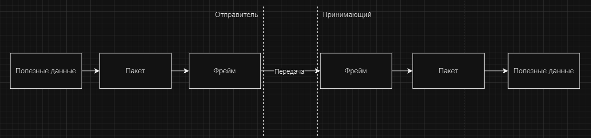

Формат байта:  
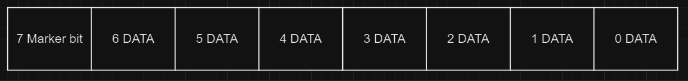

### Структура фрейма

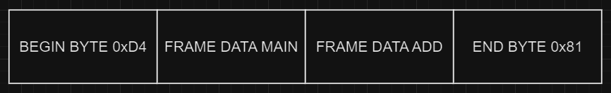

Как видно, только первый и последний байт маркируются - являются служебными для целей фрейминга.  
Так как между байтами начала и конца не должно быть маркированных байт(старшего бита в единице), то у всех байт данных снимаются старшие биты и, чтобы не потерять их, передаются в отдельных байтах(FRAME DATA ADD).  
Количество байт, которые потребуются для хранения старших битов можно посчитать так:  
`frame_data_add_len = ndata % 7 == 0 ? ndata / 7 : ndata / 7 + 1`,  
где `ndata` - размер данных, до кодирования.  
Размер поля `FRAME DATA ADD` при декодировании можно посчитать так:  
`frame_data_add_len = ndata % 8 == 0 ? ndata ~/ 8 : ndata ~/ 8 + 1`,  
где `ndata` - размер всего фрейма без учета фрейминговых байт.  

Таким образом, помещение данных во фрейм заключается в добавлении фрейминговых байт начала и конца, кодировании данных путем снятия старших бит и переноса их в конец, в отдельные байты.

Пример фрейминга:  
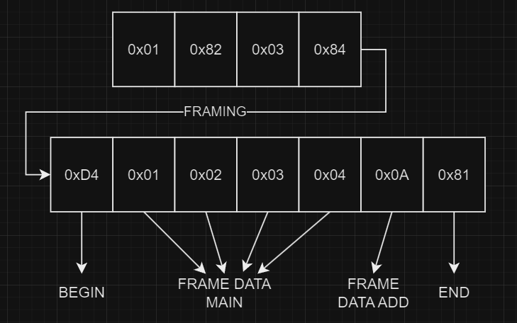

Как видно, старшие биты перешли в поле `FRAME DATA ADD`, состоящее из одного байта 0x0A.  
Если бы размер данных для фрейминга был больше 7, то потребовалось бы больше байт в поле `FRAME DATA ADD`.

### Структура пакета

При создании пакета, к полезным данным добавляется контрольная сумма CRC32, идентификаторы типа пакета, адрес устройства, номер сигнала, а также опционально пакет шифруется.

Общая структура пакета:  
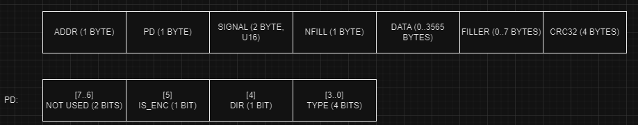

**ADDR** - Адрес ведомого устройства.  

**PD** - Packet Descriptor, от него зависит содержание и наличие поля `DATA`, состоит из нескольких битовых полей:  
- **IS_ENC** - зашифровано ли поле данных.  
- **DIR** - направление пакета, 1 - запрос от мастера, 0 - ответ ведомого.  
- **TYPE** - тип операции, может быть:
    * **WRITE** - `0b0000` операция записи сигнала, в запросе поле данных МОЖЕТ быть НЕ пустым, в ответе пустое;
    * **WRITE_NO_ANSW** - `0b0010` операция записи сигнала, в запросе поле данных МОЖЕТ быть НЕ пустым, в отличии от просто `WRITE` ведомое устройство не отвечает подтверждением или ошибкой;
    * **READ** - `0b0001` операция чтения сигнала, в запросе поле данных пустое, в ответе МОЖЕТ быть НЕ пустым;
    * **STREAM_OPEN** - `0b0011` - операция открытия стрима;
    * **STREAM_CLOSE** - `0b0100` - операция закрытия стрима;
    * **STREAM_DATA** - `0b0101` - трансляция стрима ведомым устройством;
    * **ENC_OPEN** - `0b0110` операция открытия шифрованной сессии;
    * **WRITE_AUTH_REQ** - `0b0111` операция принудительной аутентификации записи сигнала;
    * **WRITE_WITH_AUTH** - `0b1000` операция записи сигнала с аутентификацией;
    * **ERR** - `0b1111` пакет с ошибкой, возвращается ведомым устройством при невозможности выполнить запрос.

**SIGNAL** - 16-ти битный идентификатор сигнала - раздел информации у ведомого устройства, аналог регистров в ModBus.  
**DATA** - поле полезных данных.  
**CRC32** - контрольная сумма CRC32 с полиномом `0x04C11DB7`.  
**NFILL** - количество байт в поле **FILLER**.  
**FILLER** - байты заполнения, не несут в себе информации, нужны для того, чтобы размер поля шифруемых данных(DATA+FILLER) имел длину, кратную 8.

### Запись сигнала

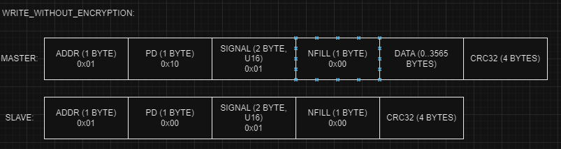

### Чтение сигнала

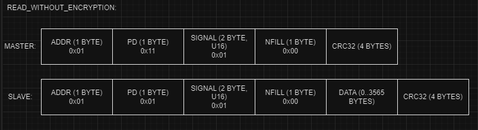

### Стрим

Режим стрима - это непрерывная отправка пакетов ведомым устройством длительное время, без запросов.  
Предназначен для мониторинга быстроизменяющихся данных, с допустимыми потерями.

Открытие стрима:  
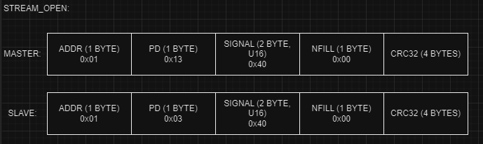

Публикация данных стрима без шифрования:  
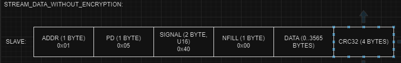

Закрытие стрима:  
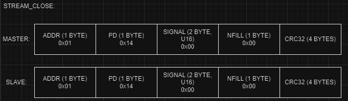

### Шифрованная сессия

При операциях с шифрованием поле данных(`DATA`) и заполнитель(`FILLER`) шифруются алгоритмом симметричного шифрования Raiden.  
Такие операции помечаются флагом `IS_ENC`, если запрос был помечен этим флагом, то и ответ тоже должен быть с этим флагом и зашифрован. Даже в случае ошибки. 

Перед тем, как использовать шифрование, необходимо получить ключ шифрования, данные шифруются ключем выданным на сессию, а не исходным, чтобы исключить хакинг записью.  
При открытии сессии ведомое устройство генерирует случайное число, на основе него ключ сессии и отправляет его зашифрованным исходным ключем в ответе. 

Открытие шифрованной сессии:  
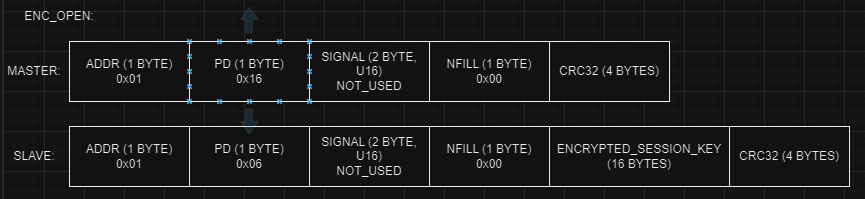

Запись и чтение с шифрованием:  
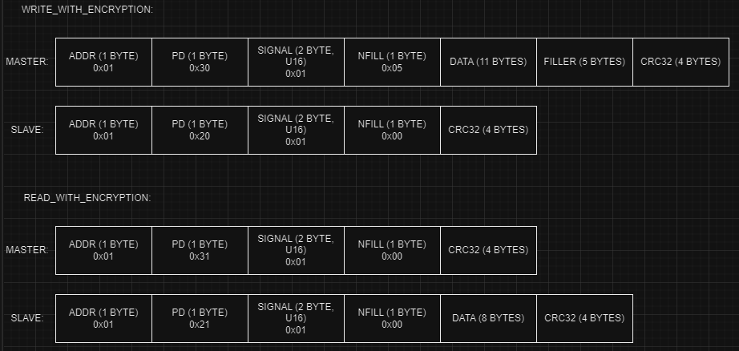

### Запись с аутентификацией

Запись с сигнатурой, подтверждающих владельца ключа сессии, может потребоваться для защиты от подмены внутри сессии или аутентификации записи без данных, например, сигнал для открытия двери.  
Запись проходит в два этапа:
1. запрос случайного числа от ведомого устройства;
2. запись с содержанием сигнатуры - зашифрованного ключем сессии, ранее считанного случайного числа.

Операция записи с шифрованием и аутентификацией:  
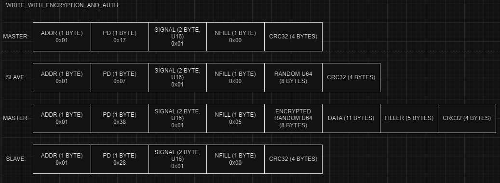

### Пример ошибки запроса

Ошибка чтения без шифрования:  
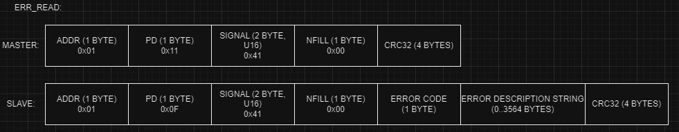

* **ERROR_CODE** - код ошибки, определяется протоколом;
* **ERROR_DESCRIPTION_STRING** - строка ошибка, определяется если `ERR_CODE` имеет значение внутренней ошибки приложения - `ERR_APP`.

Коды ошибок:

|Наименование|Код ошибки|Описание|
|--|--|--|
|ERR_APP|0x01|Внутренняя ошибка на уровне приложения, возможно описание в поле `ERROR_DESCRIPTION_STRING`|
|ERR_NO_SIG|0x02|Ведомое устройство не имеет запрашиваемого сигнала|
|ERR_NO_OPERATION|0x03|Сигнал на ведомом устройстве найден, но не определена операция чтения/записи|
|ERR_ENC_REQUIRED|0x04|Операции с этим сигналом доступны только с шифрованием|
|ERR_AUTH_REQUIRED|0x05|Запись для этого сигнала может проводиться только с шифрованием И аутентификацией|

## Broadcast

Широковещательный адрес - 0x00.  
Допустимые типы запросов для широковещательного адреса:
- `WRITE_NO_ANSW`;
- `STREAM_CLOSE`.

## Стандартные сигналы

Если устройство, располагает этими данными, то по возможности нужно реализовывать обработчики для этих сигналов.

Диапазон сигналов: [0;15].

|Наименование|Номер|Режим|Описание|
|--|--|--|--|
|SIG_RESET|0|W|Перезагрузка устройства, перезагружается записью, если записывается число больше нуля - перезагрузка с зависанием в загрузчике|
|SIG_INFO|1|R|Информация об устройстве, TLV: 1=>NAME(STRING) 2=>VERSION([u8;3]) 3=>SERIAL(STRING)|
|SIG_AUTH_KEY|14|WA|Обновить исходный ключ аутентификации, {[u8;16]}|
|SIG_PICK|15|W|Сигнал для проверки связи с устройством|

### Стандартные сигналы для загрузчика

Сигналы, необходимые для реализации загрузчика по ECB.

Диапазон сигналов: [16;23].

|Наименование|Номер|Режим|Описание|
|--|--|--|--|
|SIG_BOOT_BEGIN|16|W(E)|Начать загрузку прошивки, проверяется ключ, стирается предыдущая,  
TLV: 1=>NAME(STRING), 2=>VERSION([u8;3]), 3=>SERIAL(STRING) 4=>TEST_PHRASE(STRING), 5=>SIZE(u32)|
|SIG_BOOT_END|17|W|Завершить загрузку прошивки, {CHECKSUM(U32), SIZE(U32)}|
|SIG_BOOT_CHECKSUM|18|R|Контрольная сумма прошивки|
|SIG_BOOT_FW_KEY|19|W(E)||
|SIG_BOOT_WRITE|20|W(E)|
|SIG_BOOT_APP_INFO|22|R|
|SIG_BOOT_GO_APP|23|W|

# Структура подпроектов

Все реализации библиотек ecb находятся внутри исполняемых проектов, `*-server` для ведомых, `*-client` для мастеров.  
Это обеспечивает простую возможность отладки и проверки работы библиотек.  
Формат названия подпроектов: `ecb-<роль>-<язык>-<роль с точки зрения client/server>`.

## ecb-slave-c-server

Приложение ведомого устройство, сервер, содержит внутри себя библиотеку ведомого устройства `ecb-slave-c` на языке Си и его обертки в TCP сервер, SerialPort(UART).

## ecb-master-c-client

Приложение ведущего устройства, клиент, содержит внутри себя библиотеку ведущего `ecb-master-c` на языке Си и его обертку для подключения к ведомому через TCP сокет или SerialPort(UART).

## ecb-master-dart-client

Приложение ведущего устройства, клиент, содержит внутри себя библиотеку ведущего `ecb-master-dart` на языке Dart и его обертку для подключения к ведомому через TCP сокет или SerialPort(UART).

